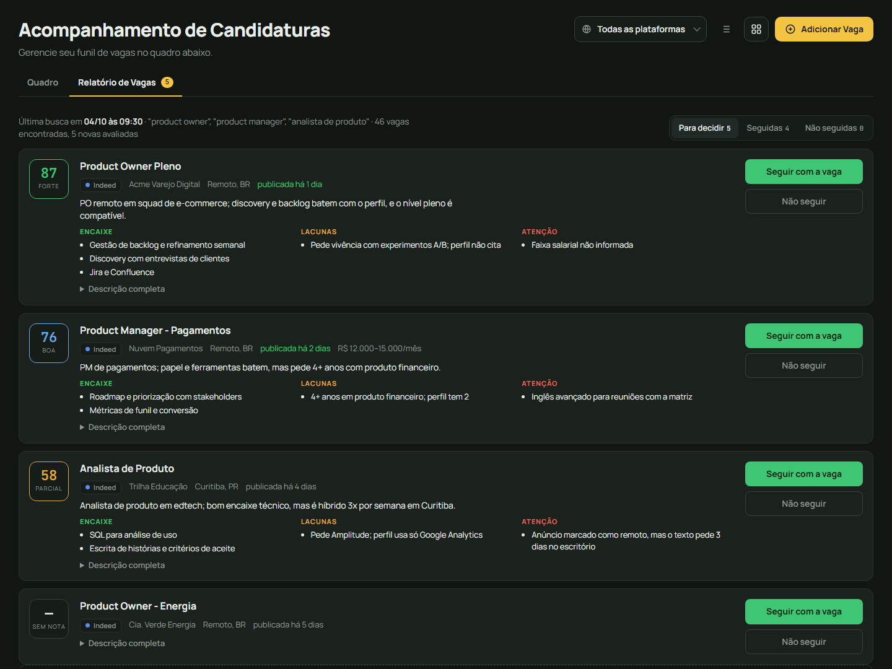
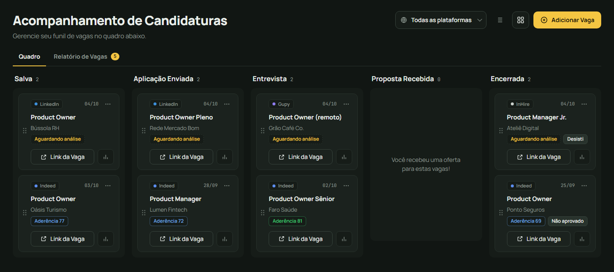
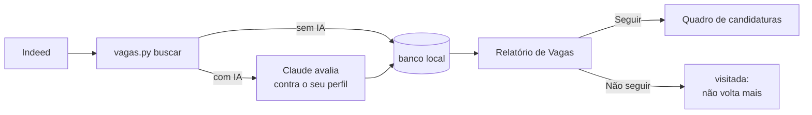

# meu-proximo-trampo

Ferramenta para quem está procurando emprego. Ela busca vagas no Indeed, monta um
relatório para você decidir o que vale a pena e acompanha suas candidaturas num
quadro kanban. Com IA (opcional), cada vaga recebe uma nota de aderência ao seu perfil,
com o que bate, o que falta e o que o anúncio esconde.

Tudo roda no seu computador: sem conta, sem login e sem servidor de terceiros.



## O que ela faz

- **Busca** vagas no Indeed com os seus cargos e filtros, que você ajusta no painel
  **Filtros da busca** do dashboard: remoto no seu país (e, se quiser, em outros
  países), híbrido e presencial só na sua cidade, data de publicação, tipo de emprego,
  senioridade, moedas aceitas para vagas de fora e empresas a excluir. Tira o ruído
  pelo título, junta anúncios repetidos e esconde vagas que você já viu.
- **Relatório de Vagas:** para cada vaga você decide **Seguir**, e ela vai para o
  quadro, ou **Não seguir**, e ela não aparece mais nas próximas buscas. O que fura os
  seus filtros (ex.: "remota" no portal, mas híbrida em outra cidade) vai para a aba
  **Fora dos critérios**, com o motivo, e ainda dá para seguir com ela. Dá para
  filtrar por senioridade, modo de trabalho, aderência mínima e dias desde a
  publicação, e cada vaga mostra o termo de busca que a encontrou.
- **Quadro de candidaturas:** Salva → Aplicação Enviada → Entrevista → Proposta
  Recebida → Encerrada, com anotações, resultado e filtro por plataforma.
- **Adicionar Vaga pelo link:** cole o link de uma vaga que você achou em outro lugar
  (Indeed, LinkedIn, Gupy, site da empresa…). O dashboard lê os dados, põe a vaga no
  relatório como as da busca e, com o Claude Code instalado, ela recebe a nota
  sozinha em cerca de 1 minuto. Se o site não deixar ler, o formulário pede o resto.
- **Com IA:** nota de 0 a 100 por vaga, encaixes, lacunas e alertas (híbrido
  disfarçado de remoto, PJ, inglês fluente, vaga afirmativa).



## Precisa de IA?

Não. A busca, o relatório e o quadro funcionam sem IA. A IA entra para avaliar as
vagas por você.

| | Sem IA | Com IA ([Claude Code](https://claude.com/claude-code)) |
|---|---|---|
| Buscar vagas | `python vagas.py buscar --gravar` | "busca vagas novas pra mim" |
| Relatório e quadro | Sim | Sim |
| Nota de aderência, encaixes, lacunas e alertas | Não | Sim |
| Analisar vagas que você adicionou pelo link ou à mão | Não | Sim, sozinho em ~1 minuto se o Claude Code estiver instalado |
| Montar a configuração e o perfil | À mão | Guiado, a partir do seu currículo |
| Gerar o currículo (.docx e PDF) | `python curriculo.py` com um JSON seu | Escrito e conferido com você, a partir do perfil |

Para usar com IA você precisa do Claude Code, com uma assinatura Claude (Pro ou Max) ou
uma chave de API da Anthropic. As skills que ensinam o Claude a fazer tudo isso já vêm
neste repositório, em `.claude/skills/` (`buscar-vagas` e `gerar-curriculo`).

## Como funciona



## Instalação

Você precisa de [Python](https://www.python.org/downloads/) 3.10 ou mais novo e do
[Git](https://git-scm.com/downloads).

```bash
git clone https://github.com/SouMarcel/meu-proximo-trampo.git
cd meu-proximo-trampo
python -m venv .venv
```

Ative o ambiente e instale a dependência:

```bash
# Windows (PowerShell)
.venv\Scripts\Activate.ps1
# macOS / Linux
source .venv/bin/activate

pip install -r requirements.txt
```

Crie a sua configuração a partir do exemplo e troque os termos pelos cargos que você
procura:

```bash
# Windows
copy config.exemplo.json config.json
# macOS / Linux
cp config.exemplo.json config.json
```

Com IA, dá para pular essa parte: abra a pasta no Claude Code e peça "quero configurar
a busca de vagas".

## Uso sem IA

1. Busque e grave tudo no relatório:

   ```bash
   python vagas.py buscar --gravar
   ```

2. Abra o dashboard:

   ```bash
   python dash/servidor.py
   ```

   No Windows, dá para dar dois cliques em `dash\abrir-dashboard.bat`. O navegador abre
   em http://127.0.0.1:8765. Para parar, feche a janela do servidor.

3. Na aba **Relatório de Vagas**, decida vaga por vaga. As que você seguir aparecem
   no **Quadro**; arraste os cartões conforme o processo anda.

Algumas buscas por semana bastam.

## Uso com IA (Claude Code)

1. Instale o [Claude Code](https://claude.com/claude-code) e abra esta pasta nele (no
   terminal, `claude`; ou pela extensão do VS Code).
2. Na primeira vez, deixe o seu currículo ou o PDF do seu LinkedIn na pasta `anexos/` e
   peça **"quero configurar a busca de vagas"**. O Claude cria o `config.json` com você
   e monta o `perfil.md` a partir desse material. Esse perfil é a base da nota de
   aderência; veja o modelo em `perfil.exemplo.md`. A pasta `anexos/` serve para
   qualquer arquivo que você queira passar ao Claude (o texto de uma vaga, um retorno
   de recrutador…).
3. No dia a dia:
   - "busca vagas novas pra mim"
   - "busca vagas de product owner dos últimos 3 dias, pode ser híbrido"
   - "analisa as vagas que adicionei no dashboard"
   - "o que está em entrevista?"
   - "monta meu currículo" / "adapta o currículo para a vaga da empresa X"

O Claude roda a busca, lê cada vaga, dá a nota, grava no dashboard e responde com um
resumo das melhores. A decisão de seguir continua sendo sua, no relatório.

### Currículo

A skill `gerar-curriculo` monta um **currículo base** a partir do seu perfil e do que
estiver em `anexos/`, só com fatos que você confirmou, e gera `.docx` e PDF num layout
de uma coluna que os sistemas de triagem (ATS) leem bem. Versão para uma vaga
específica só quando você pedir; se a vaga estiver no dashboard, o Claude usa a
descrição gravada e anota no card que gerou o currículo. Os arquivos ficam em
`curriculos/` (o `.json` é o conteúdo; editar e gerar de novo mantém tudo igual). O PDF
sai pelo Microsoft Word (Windows) ou pelo LibreOffice.

> **Privacidade:** com IA, o seu perfil e as descrições das vagas são enviados ao
> Claude (Anthropic) para a análise. Sem IA, nada sai do seu computador além das
> consultas ao Indeed e da leitura dos links que você adicionar.
>
> **Análise automática:** com o Claude Code instalado, o dashboard analisa sozinho as
> vagas que você adiciona, usando a sua assinatura. O Claude roda sem nenhuma
> ferramenta (não executa comandos nem abre sites): recebe o perfil e a vaga e só
> devolve a nota. Para desligar, ponha `"analise_automatica": false` no `config.json`.

## Configuração (`config.json`)

| Campo | O que é |
|---|---|
| `perfil` | Arquivo do seu perfil de carreira (usado só pela IA). Padrão: `perfil.md` |
| `fontes` | Portais onde buscar. Hoje: `["indeed"]` |
| `termos` | Cargos ou palavras-chave. Entre aspas (`"\"product owner\""`) busca a frase exata, o que corta muito ruído |
| `localidade` | `pais` (nome em português, ex.: `Brasil`), `estado`, `cidade` e `raio_km`. Cidade e raio valem para híbrido e presencial; o Indeed não busca por estado inteiro |
| `modelos` | `remoto`, `hibrido`, `presencial` (`true`/`false`). Remoto no país inteiro; híbrido e presencial só na cidade |
| `internacional` | `ativo`, `paises` e `termos`: vagas remotas em outros países, com uma lista curta de cargos própria (cada país × cargo é uma consulta a mais) |
| `janela_horas` | Só vagas publicadas nas últimas N horas (`168` = 7 dias) |
| `tipos_emprego` | `tempo_integral`, `pj`, `meio_periodo`, `estagio`, `temporario`. Vazio = todos; com IA, conferido na descrição |
| `senioridades` | `junior`, `pleno`, `senior`. Vazio = todas |
| `empresas_excluir` | Empresas que você não quer ver |
| `moedas_aceitas` | `USD`, `EUR`, `GBP`, `CAD`, `CHF`: em que moeda você aceita receber em vaga de fora do seu país (a moeda do seu país sempre vale). Vazio = qualquer uma; com IA, conferido na vaga |
| `resultados_por_termo` | Máximo de vagas por termo |
| `titulo_excluir` | Descarta vagas cujo título tenha alguma dessas palavras (ex.: `estagio`) |
| `titulo_incluir` | Se preenchido, só fica vaga cujo título tenha alguma dessas palavras |
| `analise_automatica` | `false` desliga a análise automática das vagas adicionadas no dashboard (padrão: ligada se o Claude Code estiver instalado) |

Quase tudo isso se ajusta no painel **Filtros da busca** (aba Relatório de Vagas do
dashboard), que grava o `config.json` por você. Vaga que fura algum filtro vai para a
aba Fora dos critérios. O formato antigo (`local`, `pais_indeed`, `somente_remoto`)
continua funcionando. Opções pontuais, sem mexer no arquivo:
`python vagas.py buscar --help`.

## Seus dados

- Vagas e candidaturas: `dash/dados/candidaturas.db` (SQLite), com uma cópia de
  segurança por dia em `dash/dados/backup/`.
- `config.json`, `perfil.md`, `anexos/`, `curriculos/`, `dash/dados/` e `.cache/` estão
  no `.gitignore` e não vão para o GitHub. Se você fizer um fork, o seu histórico continua só com você.
- Dica: mantenha a ferramenta na branch `master` e os seus ajustes pessoais numa
  branch local (por exemplo `minha`), trazendo as melhorias com `git merge master`.

## Recomendado: skills de LinkedIn (Liftli)

Recrutador olha o seu LinkedIn antes de chamar para entrevista, então vale cuidar dele
junto com as candidaturas. Recomendamos o
[linkedin-agent-skills](https://github.com/liftli-ai/linkedin-agent-skills), um conjunto
de skills para o Claude Code que audita o perfil, escreve headline e About e cria posts
e comentários no seu tom de voz. Para quem procura emprego, comece por
`linkedin-profile-checklist`, `linkedin-headline-generator` e
`linkedin-about-generator`.

**Não fazemos parte dele.** É um projeto da [Liftli](https://liftli.ai), mantido por
eles e com licença MIT; o código não está copiado aqui. Este repositório só o declara
em `.claude/settings.json`: ao abrir a pasta no Claude Code (e confiar nela), você
recebe a oferta de instalar o plugin direto do repositório deles, sempre na versão
atual. Antes de usar, leia o
[README do linkedin-agent-skills](https://github.com/liftli-ai/linkedin-agent-skills#readme)
para saber o que cada skill faz e como montar o arquivo de voz que elas usam.

Para instalar à mão, no Claude Code:

```
/plugin marketplace add liftli-ai/linkedin-agent-skills
/plugin install linkedin-agent-skills@liftli
```

## Avisos

- A busca no Indeed usa a biblioteca [python-jobspy](https://github.com/speedyapply/JobSpy),
  que acessa o Indeed de forma não oficial. Ela pode parar de funcionar se o Indeed
  mudar algo, e uso exagerado pode gerar bloqueio temporário. Use para a sua busca
  pessoal, com moderação, e respeite os termos de uso do portal.
- A nota da IA serve para triagem; ela não substitui ler a vaga.

## Próximos passos

- [x] Indeed (Brasil e outros países)
- [ ] Outros portais: LinkedIn, Gupy, InHire, Catho, Glassdoor
- [ ] Simular entrevista para as vagas na coluna Entrevista

### Adicionar um portal

Cada portal é um módulo em `fontes/` com uma função `buscar()` que devolve as vagas
num formato comum. O contrato está em [`fontes/__init__.py`](fontes/__init__.py), e o
[`fontes/indeed.py`](fontes/indeed.py) serve de exemplo. Contribuições são bem-vindas.

## Licença

[MIT](LICENSE)
