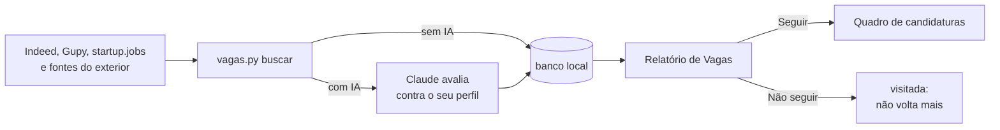

# meu-proximo-trampo

Ferramenta para quem está procurando emprego. Ela busca vagas no Indeed e na Gupy (e, se
você quiser, no startup.jobs), monta um relatório para você decidir o que vale a pena e
acompanha suas candidaturas num quadro kanban. Com IA (opcional), cada vaga recebe uma
nota de aderência ao seu perfil, com o que bate, o que falta e o que o anúncio esconde.

Tudo roda no seu computador: sem conta, sem login e sem servidor de terceiros.


## O que ela faz

- **Busca** vagas no Indeed e na Gupy (e no startup.jobs, de startups, e em portais de vagas
  remotas do exterior, se você ligar) com
  os seus cargos e filtros, que você ajusta no painel **Filtros da busca** do dashboard:
  remoto no seu país (e, se quiser, em outros países), híbrido e presencial só na sua
  cidade, data de publicação, tipo de emprego, senioridade, moedas aceitas para vagas de
  fora e empresas a excluir. Tira o ruído pelo título, junta anúncios repetidos e
  esconde vagas que você já viu.
- **Relatório de Vagas:** para cada vaga você decide **Seguir**, e ela vai para o
  quadro, ou **Não seguir**, e ela não aparece mais nas próximas buscas. O que fura os
  seus filtros (ex.: "remota" no portal, mas híbrida em outra cidade) vai para a aba
  **Fora dos critérios**, com o motivo, e ainda dá para seguir com ela. Dá para
  ordenar por aderência, plataforma, modo de trabalho ou data de publicação, filtrar
  por senioridade, modo de trabalho, aderência mínima e dias desde a publicação, e
  cada vaga mostra o termo de busca que a encontrou.
- **Quadro de candidaturas:** Salva → Aplicação Enviada → Entrevista → Proposta
  Recebida → Encerrada, com anotações, resultado e filtro por plataforma.
- **Adicionar Vaga pelo link:** cole o link de uma vaga que você achou em outro lugar
  (Indeed, LinkedIn, Gupy, startup.jobs, site da empresa…). O dashboard lê os dados, põe
  a vaga no relatório como as da busca e, com o Claude Code instalado, ela recebe a nota
  sozinha em cerca de 1 minuto. Se o site não deixar ler, o formulário pede o resto.
- **Com IA:** nota de 0 a 100 por vaga, encaixes, lacunas e alertas (híbrido
  disfarçado de remoto, PJ, inglês fluente, vaga afirmativa).


## Precisa de IA?

Não. A busca, o relatório e o quadro funcionam sem IA. A IA entra para avaliar as
vagas por você.

| | Sem IA | Com IA ([Claude Code](https://claude.com/claude-code)) |
|---|---|---|
| Buscar vagas | Botão **Buscar vagas** no relatório (ou `python vagas.py buscar --gravar`) | O mesmo botão, com nota, ou "busca vagas novas pra mim" |
| Relatório e quadro | Sim | Sim |
| Nota de aderência, encaixes, lacunas e alertas | Não | Sim |
| Analisar vagas que você adicionou pelo link ou à mão | Não | Sim, sozinho em ~1 minuto, com a IA escolhida no botão **IA** |
| Perguntas pontuais na Gupy (vagas de uma empresa, vagas PCD, salário) | Não | Sim, pelo MCP público da Gupy |
| Montar o perfil e os filtros da busca | Pela página (**Meu perfil**), com o texto dos seus arquivos ao lado | Pela página ou pelo chat: a IA propõe o rascunho a partir do currículo e do LinkedIn |
| Gerar o currículo (.docx e PDF) | `python curriculo.py` com um JSON seu | Escrito e conferido com você, a partir do perfil |

A nota das vagas pode vir de várias IAs: escolha no botão **IA** do dashboard. Dá para usar
o Claude Code (pela sua assinatura Claude Pro ou Max) ou uma chave de API da Anthropic,
OpenAI, OpenRouter, Groq, DeepSeek, Gemini ou de outro serviço compatível com a API da
OpenAI. No painel você escolhe o modelo, cola a chave, testa a conexão e vê os avisos: com
chave, o uso é cobrado pelo provedor; modelos diferentes podem dar notas um pouco diferentes;
e o seu perfil e o texto das vagas vão para o provedor escolhido. A chave fica só no arquivo
`.env` deste computador e nunca volta para a página.

As conversas (buscar vagas pelo chat, montar o currículo, consultar a Gupy) funcionam no
Claude Code e em outros assistentes de código (Codex, Gemini CLI/Antigravity, OpenCode): as
skills que ensinam isso já vêm neste repositório, em `.agents/skills/` (`analisar-perfil`,
`buscar-vagas`, `consultar-gupy` e `gerar-curriculo`), e as instruções comuns no `AGENTS.md`. Veja
[Usar com outros assistentes](#usar-com-outros-assistentes).

## Como funciona



## Instalação

Você precisa do [Python](https://www.python.org/downloads/) 3.10 ou mais novo e do
[Git](https://git-scm.com/downloads). Por enquanto o foco é o **Windows**; em macOS e Linux,
use a instalação manual mais abaixo.

```bash
git clone https://github.com/SouMarcel/meu-proximo-trampo.git
cd meu-proximo-trampo
python iniciar.py
```

Se o Windows não reconhecer `python`, use `py iniciar.py`, ou dê dois cliques em
`iniciar.bat`.

Na primeira vez, o comando explica o que vai instalar e pergunta antes: python-jobspy (busca),
python-docx (currículo) e pypdf (leitura dos PDFs nos primeiros passos). Tudo fica na pasta
`.venv/`, dentro do projeto; nada é instalado fora dela. Quem já usava a ferramenta roda o mesmo
comando depois de atualizar: ele percebe o que falta e pergunta antes de instalar. Depois ele abre a ferramenta no
navegador. Nas próximas vezes, o mesmo comando abre em segundos, sem perguntar nada; se a
ferramenta já estiver aberta, ele só mostra a página.

A ferramenta roda na janela do terminal: para parar, feche a janela ou use Ctrl+C. Seus dados
ficam salvos.

Opções: `--sim` (instala sem perguntar), `--sem-navegador`, `--rede` (acesso pelo celular no
mesmo Wi-Fi) e `--porta 8766`. Ajuda: `python iniciar.py --help`.

### Primeiros passos

Na primeira abertura, a página abre os **primeiros passos** (depois, pelo botão **Meu perfil**).
Você envia o que já tem e a ferramenta monta com você o seu perfil de carreira, a base da nota
de aderência:

1. **IA**: escolha a IA ou siga sem ela.
2. **Materiais**: currículo em PDF ou Word (.docx), o PDF do seu perfil do LinkedIn (**Mais →
   Salvar como PDF**) e/ou a exportação de dados do LinkedIn (o ZIP de **Configurações e
   privacidade → Privacidade de dados → Obter uma cópia dos seus dados**), até 10 MB cada, ou
   texto colado. O link do seu LinkedIn entra só como contato: a ferramenta não abre o LinkedIn.
3. **Rascunho**: com IA, o perfil proposto, com a fonte de cada item; quando os arquivos
   discordam (uma data, um cargo), você escolhe o valor certo. Sem IA, entra o que a exportação
   do LinkedIn tiver, e o texto dos arquivos fica ao lado para você copiar.
4. **Perguntas**, uma por vez: cargos (em português e inglês), senioridade, modelo de trabalho,
   cidade, pretensão, o que não aceita, a maior conquista dos últimos cargos e como foi medida
   (número só se você tiver certeza), ferramentas, idiomas e, se quiser, trabalho no exterior
   (remoto, morar fora, passaporte, visto, patrocínio de visto, fuso e forma de contratação).
5. **Diagnóstico** do que falta ou está fraco, com a pergunta que completa cada ponto.
6. **Revisão**: você edita o texto e só então grava. Com perfil existente, a página mostra antes
   o que muda, e a versão anterior fica em `anexos/perfis-anteriores/`.
7. **Filtros da busca** propostos a partir das respostas, que você confere antes de gravar.

Dá para parar e continuar depois. CPF, RG e data de nascimento são retirados do texto antes de
qualquer envio à IA e nunca entram no perfil. Aberta de outro aparelho (`--rede`), a página só
mostra: enviar arquivos e gravar ficam no computador onde a ferramenta roda. Pelo chat, a skill
`analisar-perfil` faz o mesmo.

### Instalação manual (alternativa)

```bash
python -m venv .venv
# Windows (PowerShell)
.venv\Scripts\Activate.ps1
# macOS / Linux
source .venv/bin/activate

pip install -r requirements.txt
```

Depois, abra o dashboard com `python dash/servidor.py`. Também continuam funcionando: a
tarefa **Dashboard** do VS Code (`.vscode/tasks.json`), que sobe o servidor ao abrir a pasta;
a página aberta pela extensão Live Server (`dash/dashboard.html`); e o
`dash\abrir-dashboard.bat`, que abre o servidor numa janela minimizada.

## Uso sem IA

1. Abra o dashboard com `python iniciar.py` (ou dois cliques em `iniciar.bat`). O navegador
   abre em http://127.0.0.1:8765. Para parar, feche a janela.

2. Na aba **Relatório de Vagas**, clique em **Buscar vagas**. A página mostra o que vai
   consultar (cargos, portais, quanto tempo leva) e, depois de você confirmar, o andamento;
   no fim, as vagas novas entram no relatório com um resumo. Dá para usar a página enquanto
   isso e cancelar a qualquer momento (busca cancelada não grava nada). Uma busca por vez no
   computador, e a próxima só 30 minutos depois da última, para os portais não bloquearem;
   se a última foi há menos de 6 horas, a página pede confirmação.

   Pelo terminal também dá, com o Python do ambiente que o `iniciar.py` preparou:

   ```bash
   .venv\Scripts\python vagas.py buscar --gravar
   ```

   (Na instalação manual, com o ambiente ativado, basta `python vagas.py buscar --gravar`.)

   No VS Code, a tarefa **Dashboard** (`.vscode/tasks.json`) sobe o servidor sozinha
   ao abrir a pasta; na primeira vez, o VS Code pergunta se permite tarefas
   automáticas. Com o servidor no ar, dá para abrir http://127.0.0.1:8765 ou o
   `dash/dashboard.html` pela extensão Live Server.

3. Na aba **Relatório de Vagas**, decida vaga por vaga. As que você seguir aparecem
   no **Quadro**; arraste os cartões conforme o processo anda.

Algumas buscas por semana bastam.

## Uso com IA (Claude Code)

1. Instale o [Claude Code](https://claude.com/claude-code) e abra esta pasta nele (no
   terminal, `claude`; ou pela extensão do VS Code).
2. Na primeira vez, monte o perfil pelos [primeiros passos](#primeiros-passos) da página
   ou pelo chat: deixe o seu currículo ou o PDF do seu LinkedIn na pasta `anexos/` e peça
   **"monta meu perfil"**. Esse perfil é a base da nota de aderência; veja o modelo em
   `perfil.exemplo.md`. Para os filtros, use o painel **Filtros da busca** ou peça "quero
   configurar a busca de vagas". A pasta `anexos/` serve para qualquer arquivo que você
   queira passar ao Claude (o texto de uma vaga, um retorno de recrutador…).
3. No dia a dia:
   - "busca vagas novas pra mim"
   - "busca vagas de product owner dos últimos 3 dias, pode ser híbrido"
   - "analisa as vagas que adicionei no dashboard"
   - "o que está em entrevista?"
   - "quais vagas PCD de analista de dados tem na Gupy?" / "o que a empresa X tem
     aberto na Gupy?"
   - "monta meu currículo" / "adapta o currículo para a vaga da empresa X"

O Claude roda a busca, lê cada vaga, dá a nota, grava no dashboard e responde com um
resumo das melhores. A decisão de seguir continua sendo sua, no relatório.

Com uma IA escolhida no botão **IA** e o perfil montado, o botão **Buscar vagas** da página
também dá a nota: as vagas novas entram no relatório e a IA as analisa em seguida, em lotes.

As perguntas pontuais sobre a Gupy usam o MCP público de candidatos da Gupy, declarado
em `.mcp.json` com o nome `gupy-candidato`. Na primeira vez, o Claude Code pede para
você aprovar esse servidor (ou rode `/mcp`). A busca de rotina não depende dele.

### Currículo

A skill `gerar-curriculo` monta um **currículo base** a partir do seu perfil e do que
estiver em `anexos/`, só com fatos que você confirmou, e gera `.docx` e PDF num layout
de uma coluna que os sistemas de triagem (ATS) leem bem. Versão para uma vaga
específica só quando você pedir; se a vaga estiver no dashboard, o Claude usa a
descrição gravada e anota no card que gerou o currículo. Os arquivos ficam em
`curriculos/` (o `.json` é o conteúdo; editar e gerar de novo mantém tudo igual). O PDF
sai pelo Microsoft Word (Windows) ou pelo LibreOffice.

Antes de escrever, a skill pergunta as **técnicas** de cada currículo, com caixas de marcar:
**ATS** (palavras-chave da vaga reformuladas a partir do que você tem, nunca inventadas),
**foco** num cargo (experiências escolhidas e ordenadas, com até 3 destaques), **XYZ** (conquista
+ medida + como, só com número que você confirmou), **resultado primeiro** e **competências
primeiro**; e as escolhas de **páginas** (1 ou 2), **formato do país** (Brasil: A4 e português;
Estados Unidos: Letter, inglês, sem foto nem dados pessoais; Europa: A4 e inglês) e **estilo**
(padrão, compacto ou executivo, com o corpo nunca abaixo de 10 pt). Ela sugere as escolhas pela
vaga e você troca o que quiser (`python curriculo.py --tecnicas` mostra o catálogo).

Antes de entregar, uma **conferência sem IA** (`python conferir.py curriculos/<nome>.json`,
também rodada no fim de cada geração) dá o veredito ok, conferir ou bloquear: números, empresas,
cargos e datas que não estão no seu perfil; cada requisito da vaga como tem, sustentado ou lacuna
(lacuna nunca vira competência); e problemas de ATS (tabelas, imagens, contato no cabeçalho,
cobertura das palavras-chave). Número fora do perfil bloqueia a entrega até você confirmar ou
tirar. Passou do limite de páginas, o gerador avisa e sugere o que cortar, sem encolher a fonte.

**Pela página**, com uma IA escolhida no botão **IA** e o perfil montado: no detalhe de uma vaga,
**Gerar currículo** abre as mesmas técnicas (com a sugestão para a vaga já marcada); ao confirmar, a
IA escreve só com os fatos do perfil, a ferramenta gera o `.docx` e o PDF em `curriculos/` (nome com
data, empresa e cargo, sem apagar versões anteriores) e roda a conferência. A vaga lista os
currículos gerados, com links para abrir o PDF e baixar o `.docx`; com "bloquear", o currículo
aparece como **não pronto**, com o que resolver. O **currículo base** sai do mesmo jeito, no botão
**Meu perfil**. Nada vai para a IA antes do clique; com IA por chave, cada currículo é uma chamada
cobrada pelo provedor.

> **Privacidade:** com IA, o seu perfil e as descrições das vagas são enviados ao
> provedor escolhido no botão **IA** (Anthropic, OpenAI, Google etc.) para a análise. Em
> planos gratuitos, alguns provedores podem usar os dados enviados; confira os termos. Sem
> IA, nada sai do seu computador além das consultas aos portais e da leitura dos links que
> você adicionar.
>
> **Análise automática:** com uma IA escolhida (sem configurar nada, vale o Claude Code, se
> estiver instalado), o dashboard analisa sozinho as vagas que você adiciona. A IA não
> recebe ferramentas (não executa comandos nem abre sites): recebe o perfil e a vaga e só
> devolve a nota, e o detalhe da vaga mostra qual IA deu a nota. Para desligar, escolha
> **Sem IA** no painel.

## Usar com outros assistentes

As mesmas conversas do Claude Code funcionam em outros assistentes de código que leem o
`AGENTS.md` e skills no formato `SKILL.md`. Abra a pasta no assistente e peça como faria no
Claude Code: "busca vagas novas pra mim", "monta meu currículo", "tem vaga de analista na
empresa X na Gupy?".

| Assistente | Como abrir | O que muda |
|---|---|---|
| Claude Code | `claude` na pasta (ou a extensão do VS Code) | Nada: é o caminho principal. As skills de LinkedIn recomendadas abaixo são só dele |
| Codex (OpenAI) | `codex` na pasta | Não tem ferramenta de perguntas com opções nem de ler links: ele pergunta em texto e pede que você cole o texto da vaga. A Gupy vai pelo comando `consultar_gupy.py` |
| Gemini CLI | `gemini` na pasta | Na primeira vez ele pergunta se confia na pasta: responda que sim, senão ignora as skills e a configuração do projeto. Lê o `AGENTS.md` e já vem com a integração da Gupy (`.gemini/settings.json`). Desde 18/06/2026 exige chave paga da API do Gemini; sem ela, use o **Antigravity CLI** (`agy`), que lê as mesmas skills |
| OpenCode | `opencode` na pasta | Lê as skills de `.agents/skills/` e também a cópia de `.claude/skills/`, então avisa "duplicate skill name" (o conteúdo é igual). Para silenciar, defina `OPENCODE_DISABLE_CLAUDE_CODE_SKILLS=1` |

Para ligar a integração MCP da Gupy no Codex ou no OpenCode (opcional; sem ela, a skill usa o
`consultar_gupy.py`):

```toml
# .codex/config.toml (com o projeto marcado como confiável no Codex)
[mcp_servers.gupy-candidato]
url = "https://candidates.mcp.api.gupy.io/mcp"
```

```json
{ "mcp": { "gupy-candidato": { "type": "remote", "url": "https://candidates.mcp.api.gupy.io/mcp" } } }
```

(o segundo vai no `opencode.json` da raiz).

As skills ficam em `.agents/skills/` (a fonte). O Claude Code só lê `.claude/skills/`, onde fica
uma cópia gerada: para mudar uma skill, edite em `.agents/skills/` e rode
`python sincronizar_skills.py` (com `--conferir`, ele só aponta cópia diferente). Testamos no
Claude Code; Codex, Gemini CLI e OpenCode seguem a documentação oficial de cada um — se algo não
funcionar, abra uma issue.

## Configuração (`config.json`)

| Campo | O que é |
|---|---|
| `perfil` | Arquivo do seu perfil de carreira (usado pela IA; montado nos primeiros passos). Padrão: `perfil.md` |
| `fontes` | Portais onde buscar: `indeed`, `gupy` e `startupjobs` (padrão: `indeed` e `gupy`). O `startupjobs` traz vagas de startups, a maior parte de fora do Brasil e muitas remotas; veja os Avisos |
| `termos` | Cargos ou palavras-chave. Entre aspas (`"\"product owner\""`) busca a frase exata, o que corta muito ruído |
| `localidade` | `pais` (nome em português, ex.: `Brasil`), `estado`, `cidade` e `raio_km`. Cidade e raio valem para híbrido e presencial; o Indeed não busca por estado inteiro, e a Gupy busca só na cidade, sem raio |
| `modelos` | `remoto`, `hibrido`, `presencial` (`true`/`false`). Remoto no país inteiro; híbrido e presencial só na cidade |
| `internacional` | Busca no exterior, desligada por padrão (painel **Filtros da busca internacional**): `ativo`, `paises`, `termos` (cargos em inglês), `regioes`, `salario_min_anual_usd`, `fuso_horas`, `contratacao`, a sua situação (`aceita_mudar` + `paises_mudanca`, `passaporte`, `autorizacao_trabalho`, `precisa_sponsor`), `fontes` (fontes do exterior: `remotive`, `himalayas`, `remoteok`, `jobicy`, `weworkremotely`, `getonboard`), `empresas` (empresas acompanhadas no Greenhouse, Lever ou Ashby, informadas pelo link da página de vagas), `frases_restricao` e `frases_positivas`. Cada país × cargo é uma consulta a mais; as fontes do exterior fazem uma consulta por cargo (as listas, uma por busca) |
| `idiomas_aceitos` | `pt`, `en`, `es`, `fr`, `de`, `it`: vaga em outro idioma vai para Fora dos critérios. Vazio = todos |
| `janela_horas` | Só vagas publicadas nas últimas N horas (`168` = 7 dias) |
| `tipos_emprego` | `tempo_integral`, `pj`, `meio_periodo`, `estagio`, `temporario`. Vazio = todos; com IA, conferido na descrição |
| `senioridades` | `junior`, `pleno`, `senior`. Vazio = todas |
| `empresas_excluir` | Empresas que você não quer ver |
| `moedas_aceitas` | `USD`, `EUR`, `GBP`, `CAD`, `CHF`: em que moeda você aceita receber em vaga de fora do seu país (a moeda do seu país sempre vale). Vazio = qualquer uma; com IA, conferido na vaga |
| `resultados_por_termo` | Máximo de vagas por termo |
| `titulo_excluir` | Descarta vagas cujo título tenha alguma dessas palavras (ex.: `estagio`) |
| `titulo_incluir` | Se preenchido, só fica vaga cujo título tenha alguma dessas palavras |
| `ia` | A IA escolhida no painel: `provedor` (`claude_code`, `anthropic`, `openai`, `openrouter`, `groq`, `deepseek`, `gemini`, `compativel` ou `nenhum`), `modelo` e, no `compativel`, `url_base`. Nunca guarda a chave, que fica no `.env` |
| `analise_automatica` | Formato antigo: `false` equivale a "Sem IA" quando não há `ia` |

Quase tudo isso se ajusta no painel **Filtros da busca** (aba Relatório de Vagas do
dashboard), que grava o `config.json` por você.

**Vagas internacionais.** Opcional e desligado: na aba **Internacional**, o painel **Filtros da
busca internacional** liga a busca no exterior e reúne países, cargos em inglês, regiões,
moedas, salário mínimo anual em dólar, fuso, formas de contratação e a sua situação (aceito
morar fora, passaporte, visto ou autorização de trabalho, precisa de sponsor). As vagas de fora
aparecem só na aba Internacional, com a etiqueta **Internacional · país** (e a moeda) em todo
lugar; o Quadro é comum, com filtro por área. Com "aceito morar fora", a busca inclui vagas
presenciais e híbridas nos países escolhidos. A sua situação vai para a análise da IA, que
aponta o que pode impedir (autorização, sponsor, fuso). Cada portal só roda nas buscas que
atende (a Gupy, por exemplo, só no Brasil).

**Fontes do exterior e empresas que você acompanha.** No mesmo painel, você liga as fontes de
vagas remotas que quiser (Remotive, Himalayas, Remote OK, Jobicy, We Work Remotely, Get on
Board; todas desligadas até você marcar) e cola o link da página de vagas das empresas que
acompanha no Greenhouse, no Lever ou no Ashby (ex.: `jobs.lever.co/empresa`). A busca consulta
cada fonte e cada empresa uma vez e filtra pelos cargos em inglês. Cada vaga traz, quando o
portal informa, onde ela aceita candidatos, o salário, a moeda, o link de candidatura e o
sistema de candidatura usado.

**Elegibilidade.** Sem IA, a ferramenta lê a restrição de local do portal e frases comuns do
anúncio ("US only", "must be authorized to work in", "we do not sponsor visas", "open to
candidates in LATAM", "relocation package"…) e compara com a sua situação: vaga que exige
autorização de trabalho num país onde você não tem (e não patrocina visto), restrita a uma
região que não inclui o seu país ou fora das regiões que você aceita, ou presencial e híbrida
sem você aceitar morar fora vai para Fora dos critérios, com o motivo. Oferta de patrocínio de
visto ou de relocation vira uma etiqueta verde na vaga. Se o anúncio é ambíguo, a vaga passa.
Você pode acrescentar as suas frases: as que cortam e as que viram sinal positivo. Vaga que fura algum filtro vai para a
aba Fora dos critérios. O formato antigo (`local`, `pais_indeed`, `somente_remoto`)
continua funcionando. Opções pontuais, sem mexer no arquivo:
`python vagas.py buscar --help`.

## Seus dados

- Vagas e candidaturas: `dash/dados/candidaturas.db` (SQLite), com uma cópia de
  segurança por dia em `dash/dados/backup/`.
- `config.json`, `perfil.md`, `anexos/`, `curriculos/`, `dash/dados/` e `.cache/` estão
  no `.gitignore` e não vão para o GitHub. Os primeiros passos guardam os arquivos enviados
  em `anexos/primeiros-passos/`, as versões anteriores do perfil em
  `anexos/perfis-anteriores/` e o progresso em `.cache/primeiros-passos.json`. O mesmo vale para `.liftli/` (o tom de voz
  das skills de LinkedIn), `linkedin/` (banners e imagens dos seus posts) e `.env`
  (as chaves de API: as da IA, cadastradas pelo painel, e a opcional do startup.jobs). Se você fizer um fork, o seu
  histórico continua só com você.
- Dica: mantenha a ferramenta na branch `master` e os seus ajustes pessoais numa
  branch local (por exemplo `minha`), trazendo as melhorias com `git merge master`.

## Recomendado: skills de LinkedIn (Liftli)

Recrutador olha o seu LinkedIn antes de chamar para entrevista, então vale cuidar dele
junto com as candidaturas. Recomendamos o
[linkedin-agent-skills](https://github.com/liftli-ai/linkedin-agent-skills), um conjunto
de skills para o Claude Code que audita o perfil, escreve headline e About e cria posts
e comentários no seu tom de voz. Para quem procura emprego, comece por
`linkedin-profile-checklist`, `linkedin-headline-generator` e
`linkedin-about-generator`.

**Não fazemos parte dele.** É um projeto da [Liftli](https://liftli.ai), mantido por
eles e com licença MIT; o código não está copiado aqui. Este repositório só o declara
em `.claude/settings.json`: ao abrir a pasta no Claude Code (e confiar nela), você
recebe a oferta de instalar o plugin direto do repositório deles, sempre na versão
atual. Antes de usar, leia o
[README do linkedin-agent-skills](https://github.com/liftli-ai/linkedin-agent-skills#readme)
para saber o que cada skill faz e como montar o arquivo de voz que elas usam.

Para instalar à mão, no Claude Code:

```
/plugin marketplace add liftli-ai/linkedin-agent-skills
/plugin install linkedin-agent-skills@liftli
```

## Avisos

- A busca no Indeed usa a biblioteca [python-jobspy](https://github.com/speedyapply/JobSpy),
  que acessa o Indeed de forma não oficial. Ela pode parar de funcionar se o Indeed
  mudar algo, e uso exagerado pode gerar bloqueio temporário. Use para a sua busca
  pessoal, com moderação, e respeite os termos de uso do portal.
- A busca na Gupy usa o MCP público de candidatos da própria Gupy
  (`https://candidates.mcp.api.gupy.io/mcp`), oficial, sem login e só de leitura. Ele
  não filtra por data nem busca frase exata: a ferramenta ordena pela publicação e para
  na janela escolhida, e o filtro de título tira o ruído.
- A busca no startup.jobs usa o MCP público do próprio site (`https://api.startup.jobs/mcp`),
  sem login e só de leitura. Sem conta, ele mostra só as vagas dos últimos 14 dias e
  aceita 20 consultas por minuto; a ferramenta espaça as consultas sozinha. Ele filtra
  só por país: na busca na cidade, ficam as vagas cujo local é a sua cidade, sem raio. A
  chave de API é opcional (identifica o seu uso; o acesso total o site libera por
  e-mail): ponha `MCP_STARTUP_JOBS=sua_chave` no arquivo `.env` da raiz, que fica fora
  do Git. Se o site recusar a chave, a busca segue sem ela e avisa.
- As fontes do exterior são APIs e feeds públicos, sem login, oferecidos pelos próprios
  portais para divulgar as vagas. Em todas, a ferramenta mostra de onde veio a vaga e leva
  para o anúncio original; a candidatura é sempre feita lá. Termos de cada uma:
  - **Remotive** (`remotive.com/api/remote-jobs`): citar a Remotive e linkar a vaga original;
    no máximo 4 consultas por dia (a ferramenta guarda a lista por 6 horas em `.cache/`); as
    vagas chegam com 24 horas de atraso, e a lista pública é pequena (poucas dezenas de vagas).
  - **Remote OK** (`remoteok.com/api`): citar o Remote OK e linkar a vaga original; sem usar o
    logotipo.
  - **Jobicy** (`jobicy.com/api/v2/remote-jobs`): creditar o Jobicy com link e mandar a
    candidatura sempre para o link original da vaga.
  - **Himalayas** (`himalayas.app/jobs/api`), **We Work Remotely** (RSS em
    `weworkremotely.com/remote-jobs.rss`) e **Get on Board** (`getonbrd.com/api/v0`): a resposta
    não traz termos próprios; a ferramenta cita a fonte, linka a vaga e consulta pouco (uma
    lista por busca, ou uma consulta por cargo).
  - **Greenhouse, Lever e Ashby**: as APIs públicas das páginas de vagas das empresas, uma
    consulta por empresa por busca.
- A elegibilidade lê só o que o anúncio diz e erra para o lado de deixar passar: confira a
  vaga antes de se candidatar.
- A nota da IA serve para triagem; ela não substitui ler a vaga.

## Próximos passos

- [x] Indeed (Brasil e outros países)
- [x] Gupy
- [x] startup.jobs (vagas de startups; opcional)
- [x] Fontes do exterior (Remotive, Himalayas, Remote OK, Jobicy, We Work Remotely, Get on Board)
  e empresas acompanhadas no Greenhouse, Lever e Ashby; opcionais
- [ ] Outros portais: LinkedIn, InHire, Catho, Glassdoor
- [ ] Simular entrevista para as vagas na coluna Entrevista

### Adicionar um portal

Cada portal é um módulo em `fontes/` com uma função `buscar()` que devolve as vagas
num formato comum. O contrato está em [`fontes/__init__.py`](fontes/__init__.py), e o
[`fontes/indeed.py`](fontes/indeed.py) e o [`fontes/gupy.py`](fontes/gupy.py) servem de
exemplo; o [`fontes/startupjobs.py`](fontes/startupjobs.py) mostra o `descrever()`, para
portal cuja busca não traz a descrição. Portais do exterior sem filtro de país usam
`POR_PAIS = False` e o apoio de [`fontes/_comum.py`](fontes/_comum.py) (o
[`fontes/remotive.py`](fontes/remotive.py) é o exemplo mais curto). Contribuições são bem-vindas.

## Licença

[MIT](LICENSE)
